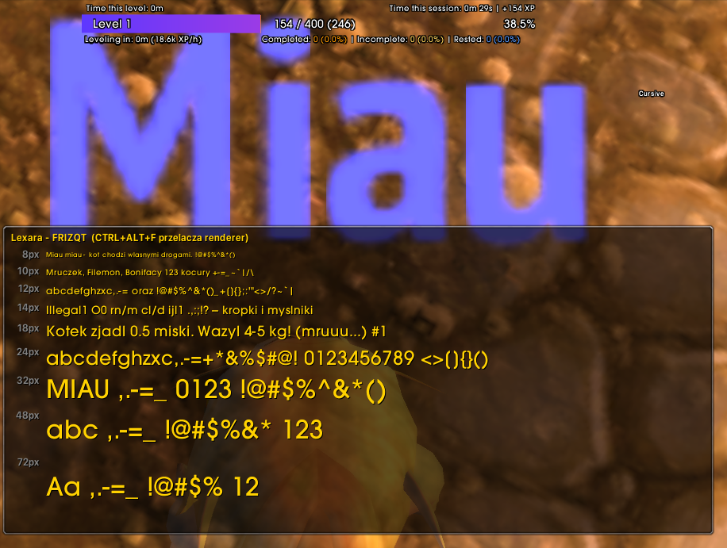
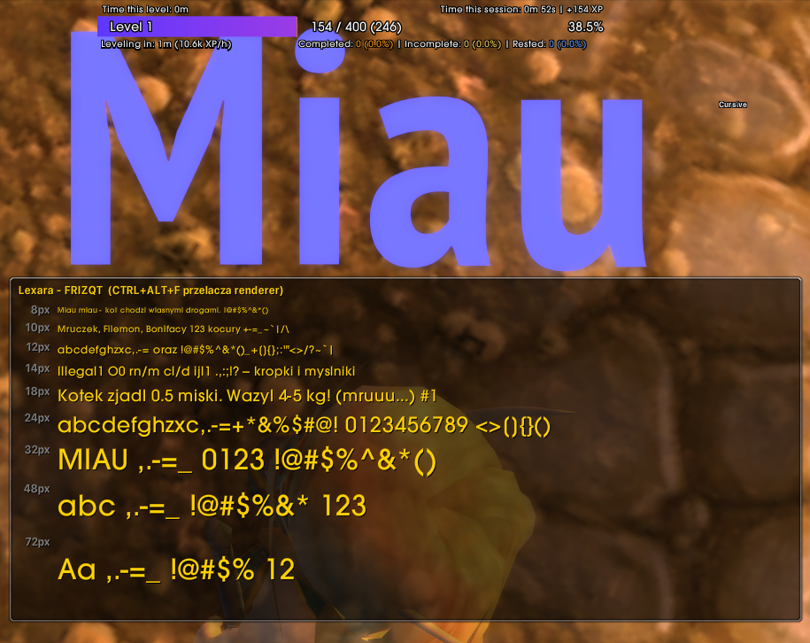

# Lexara 1.12 - HD MSDF font renderer for Turtle WoW (twmoa_1171)

A port of the MSDF-atlas font renderer from the 3.3.5a client to the 1.12 client.

Original: [Stormhand-dev/Lexara-HD-Font-Renderer-for-WoW-3.3.5](https://github.com/Stormhand-dev/Lexara---HD-Font-Renderer-for-WoW-3.3.5)
Licence: GPL-3.0 (same as the original) - see [LICENSE](LICENSE).

Made by Nobus & Aethus (Zuzia)

## Screenshots

The `/lexara` panel - the same text at 9 sizes (8-72 px) - with a large piece of UI
text above it. Same client, same typeface, same settings; only `msdf_enabled`
differs between the two shots.

**Before** - the client's own renderer. Glyphs come from a fixed-size bitmap cache,
so anything scaled up is blurred and the edges fall apart.



**After** - the MSDF renderer. The glyph outline is kept in the atlas and resolved
in the pixel shader, so the edges stay sharp at every size.



## Installation

1. Build it (`build.bat`) or take a prebuilt `lexara112.dll`.
2. Copy `lexara112.dll` into the client directory.
3. Add a `lexara112.dll` line to `dlls.txt` next to `WoW.exe`.
4. Optional: `lexara112.cfg.example` -> `lexara112.cfg` in the client directory.
5. Optional: `addon/LexaraCompare` -> `Interface/AddOns/LexaraCompare`.

**Rollback:** remove the line from `dlls.txt`. The DLL writes nothing into the
client's files - it patches process memory, so a restart without the entry returns
to the previous state.

## Usage

- **`lexara112.cfg`** - 25 switches of the form `name=0/1`; no file = everything
  enabled except the two opt-in diagnostics. 10 patch sites (`site_*`), 6 font
  hooks (`hook_*`), 2 standalone crash fixes, and the subsystem switches
  `msdf_enabled`, `ft_hooks`, `shaders`, `sync_at_draw`, `client_device`.
  **A change needs only a game restart, not a DLL rebuild** - this is the first
  tool to reach for on any regression. Full reference in the table below.
- **`CTRL+ALT+F11`** - writes `msdf_enabled` into the cfg; takes effect on the next
  start. Its handler lives in the EndScene hook that only `shared_vtable=1`
  installs, so with the default configuration the shortcut does nothing - edit the
  file instead.
- **`/lexara`** (or `/lex`) - a panel with the same text at 9 sizes (8-72 px) and a
  full set of special characters; right-click changes the typeface.
- **`lexara112.log`** - the DLL's log, sparse by default.
- Glyph cache: the `LEXARA` directory in `%TEMP%`, safe to delete.

### Configuration reference

<details>
<summary><b><code>lexara112.cfg</code> - every switch, what kind it is and what it does</b> (click to expand)</summary>

Format: one `name=0` or `name=1` per line, `#` starts a comment. Only the first
character after `=` is read, and the name has to start the line.

Two kinds of default:

- **on** - a missing file *or* a missing line means **enabled**. Everything the
  renderer needs is in this group, so a client directory with no cfg at all behaves
  like a full install.
- **opt-in** - a missing file or a missing line means **disabled**. Only the two
  diagnostics, which have a cost you have to ask for.

Note that the shipped `lexara112.cfg.example` sets `msdf_enabled=0`: copy it
verbatim and the MSDF renderer stays off until you flip that line to `1`.

#### Master and subsystem switches

| option | kind | default | what it does |
|---|---|---|---|
| `msdf_enabled` | master switch | on | The MSDF renderer as a whole. `0` = every font hook and patch site below is skipped and the client draws text exactly as it would without the DLL. Read once at start-up; `CTRL+ALT+F11` writes it. Gates everything on this page except the two crash fixes and `client_device`. |
| `ft_hooks` | subsystem | on | Replaces the client's built-in FreeType with Lexara's 2.14.1 (`FT_New_Library`, `FT_New_Memory_Face`, `FT_Done_Face`, `FT_Set_Pixel_Sizes`, `FT_Get_Char_Index`, `FT_Load_Glyph`, `FT_Get_Kerning`, `FT_Done_FreeType`). `0` = the client's library is left untouched, which disables the whole renderer. The init and `FT_Add_Default_Modules` hooks are deliberately gated under this same key - split apart, `ft_hooks=0` gave the client the new library while it still called its own old functions on it, and crashed at `77536085`. |
| `shaders` | subsystem | on | Compiles and binds our own `vs_3_0` / `ps_3_0`. Compilation is lazy, on first use: at font-init time no D3D device exists yet, and the eager version produced `vs=0 ps=0`. `0` = no MSDF shader, so no sharp glyphs. |
| `sync_at_draw` | render sync | on | Re-applies our shaders and the WorldViewProj matrix *inside* `DrawPrimitive` / `DrawIndexedPrimitive`, after the client has pushed its own lazily cached state to the device. `0` = no damage numbers over mobs - the client drops our pixel shader after the 3D world. |

#### The ten patch sites (assembly stubs written into the client's code)

| option | kind | default | what it does |
|---|---|---|---|
| `site_initbuf` | patch site `005C92F7` | on | Creates the font index buffer through our own `PoolCreate(1, 0, 0x30000)`. 1.12 has no `CGxDevice` global and `PoolCreate` is a free function, so the first two arguments go in ECX/EDX. |
| `site_allocbuf` | patch site `005C933F` | on | Raises the index-buffer fill loop counter to `0x3FFF`. In 1.12 the counter is EDI, not EBX; `mov edi, imm32` is exactly the 5 bytes the site has. |
| `site_checkgeom` | patch site `005C9001` | on | A pre-pass over the string's geometry list before the client's own loop: runs `CheckGeometry` per entry, then hands the collected codepoints to the atlas prefetch. Starts on the `jne` rather than at `005C9003` because that branch is a live jump target - patching over it gave ERROR #132, BREAKPOINT at `005C9008` on zone discovery. |
| `site_checkcall` | patch site `005C9019` | on | Calls `ProcessGeometry` on the current string - this is where the MSDF quads are actually produced. |
| `site_bufstream` | patch site `005C904A` | on | Sizes the font vertex stream from the accumulated vertex count, clamped to `0x800..0xFFFC`, instead of the client's fixed size. |
| `site_bufalloc1` | patch site `005C9067` | on | Sets the texture-batch loop bound to `0xA0` (shifted by `-0x14` from 3.3.5) and seeds the runtime VB size. EAX has to come out zeroed - the jmpback writes it to two locals. |
| `site_bufalloc2` | patch site `005C915D` | on | Flushes the vertex buffer for the difference between what was written and what is needed. In 1.12 `bufalloc` takes `ecx=&stream, edx=size` and cleans its own stack, and the stream local sits at `[ebp-0x1C]`. |
| `site_bufalloc3` | patch site `005C9129` | on | The same flush at the other call site. Here the `lea` for the stream falls inside the patched range, so the stub has to repeat it. |
| `site_procbatch` | patch site `005C91A8` | on | Zeroes the runtime VB counter at the end of the batch. Exactly 5 bytes, and `005C91A9` is the target of a `je` from `005C8FF3` - what makes it safe is `site_initbuf` guaranteeing the buffer pointer is never null. |
| `site_glyphy` | patch site `005D137A` | on | For an MSDF font, zeroes ECX so the client skips its own Y-metrics chain; for anything else it reproduces the original. Rewritten for 1.12's registers - EDX is live here, and the version carried over from 3.3.5 clobbered it, which sent characters off-screen. |

#### The six hooks on the client's font functions

| option | kind | default | what it does |
|---|---|---|---|
| `hook_renderbatch` | hook on `CGxuFont::RenderBatch` | on | Unbinds our shaders and resets the SDF control register once the batch is drawn. Mandatory: without it the rest of the interface is drawn with the font shader. In 3.3.5 the client switched back by itself. |
| `hook_renderglyph` | hook on `CGxuFont::RenderGlyph` | on | Corrects the glyph Y metrics for MSDF fonts (`bearingY -= verAdv`). The fields are unsigned but the client reads the result as signed, and a character below the baseline is supposed to come out negative. |
| `hook_getglyph` | hook on `CGxFont::GetOrCreateGlyphEntry` | on | Smuggles the codepoint into the cache entry (`u0 = 1 + codepoint`) and zeroes the cell indices and page index, which is how the MSDF path finds the glyph later. |
| `hook_checkgeom` | hook on `CGxString::CheckGeometry` | on | Drops cached geometry when the atlas has been evicted since the string was built (a version token in the top byte of `m_flags`), and accumulates the vertex count used to size the stream. |
| `hook_writegeom` | hook on `CGxString::WriteGeometry` | on | Rewrites the vertices the client just wrote into MSDF quads. Also where `diag_damage` dumps the damage batch from. |
| `hook_initline` | hook on `CGxString::InitializeTextLine` | on | Collects the line's characters for the atlas prefetch and marks the string with `0x40000000`. Optional - its absence costs performance, not correctness. |

#### Standalone crash fixes - independent of `msdf_enabled`

Both are installed outside the renderer's gate: they concern textures, not fonts,
and are meant to work with the MSDF renderer off. Both verify the bytes at their
site first and skip (with a log line) if the client is not the one they were
written for.

| option | kind | default | what it does |
|---|---|---|---|
| `site_texnullfill` | crash fix at `00448920` | on | A NULL check before the "fill with white", which fixes the `0x00448955` crash on a texture that does not exist. `0` = the crash returns. See [`docs/tex-null-fill.md`](docs/tex-null-fill.md). |
| `site_chartexmips` | crash fix at `00477C80` / `00477DB0` / `00477F20` | on | Caps the mip levels pasted into the 256x256 character-skin canvas at its own 9. A 512x256 component - from a hi-res texture patch, say - otherwise writes a pixel value through on its 10th level, which is the `0x0047801D` crash. `0` = the crash returns. See [`docs/char-tex-mips.md`](docs/char-tex-mips.md). |

#### Device capture and diagnostics

| option | kind | default | what it does |
|---|---|---|---|
| `client_device` | device capture | on | Also reads the device straight from the client's own pointer (`[00C0ED38] + 0x38A8`) and prefers it over whatever the `CreateDevice` capture chain caught. Needed when `d3d9.dll` is unloaded and loaded again at another base, which left a user with no text at all. `0` = the capture chain only, as before. |
| `shared_vtable` | diagnostic | **opt-in** | Creates a throwaway 8x8 device just to read the address of the D3D9 virtual table. **This was the cause of the animation stutter on every model** - merely creating it was enough, even with none of our code running during the frame. Enable for diagnostics only. Side effect while on: the `CTRL+ALT+F11` shortcut works, because its handler lives in the EndScene hook installed this way. See [`docs/animation-stutter-M2.md`](docs/animation-stutter-M2.md). |
| `diag_damage` | diagnostic | **opt-in** | Logs the damage-text batch (`00CE8800`): the strings, their vertices before and after our rewrite, and the device state the draw actually receives. Verbose - for investigating damage numbers, not for normal play. |

</details>

## Building

```
build.bat
```

Requires **VS 2022 BuildTools** (the x86 toolset; Community without the toolset is
not enough) and CMake. `build.bat` takes `cmake` from PATH, and when it is not
there, from the `LEXARA_CMAKE` variable. Result:
`build/out/Release/lexara112.dll`.

## Dependencies

`third_party/` is vendored in this repository (the original Lexara does not bundle
it):

| directory | source | notes |
|---|---|---|
| `freetype-2.14.1` | github.com/freetype/freetype, tag `VER-2-14-1` | the version Lexara uses |
| `msdfgen` | github.com/Chlumsky/msdfgen | SVG and PNG **disabled** (they pull in tinyxml2/libpng) |
| `Detours` | github.com/microsoft/Detours | added: `CMakeLists.txt` and a `detours.h` forwarder |
| `unordered_dense_src` | github.com/martinus/unordered_dense | header only |

**msdfgen without Skia** has no `resolveShapeGeometry`; it is replaced in
`src/font_exact/MSDFCompat.h` with the same thing msdfgen itself uses in its place
(`shape.orientContours()`, `main.cpp:1155`).

## Documentation

- [`docs/lexara.md`](docs/lexara.md) - everything worth knowing: status, usage,
  **how this port differs from the original**, the list of modified Lexara files,
  pitfalls, the ten bugs that only showed up in game.
- [`docs/lexara-port-map.md`](docs/lexara-port-map.md) - **1.12 addresses,
  structure layouts, calling conventions, the course of stages 1-5.** Start here
  for any work on hooking the client.
- [`docs/README-port-first-test.md`](docs/README-port-first-test.md) - the README
  as it stood just before the first launch; historical, but it holds the list of
  things that could not be settled statically.

## Reporting bugs

Please include:

1. **`lexara112.log`** - in full, it is short.
2. **`lexara112.cfg`** - or a note that the file is absent.
3. **The client version** and the list from `dlls.txt` (the order matters).
4. **The result of bisecting through the cfg**: disable `msdf_enabled`, then
   `shaders`, then `ft_hooks`, then the `site_*` entries in groups. Which switch
   removes the symptom is half the diagnosis and needs no DLL rebuild.
5. On a crash: the contents of the client's `Errors/` directory and the DXVK log
   (`*_d3d9.log`).
